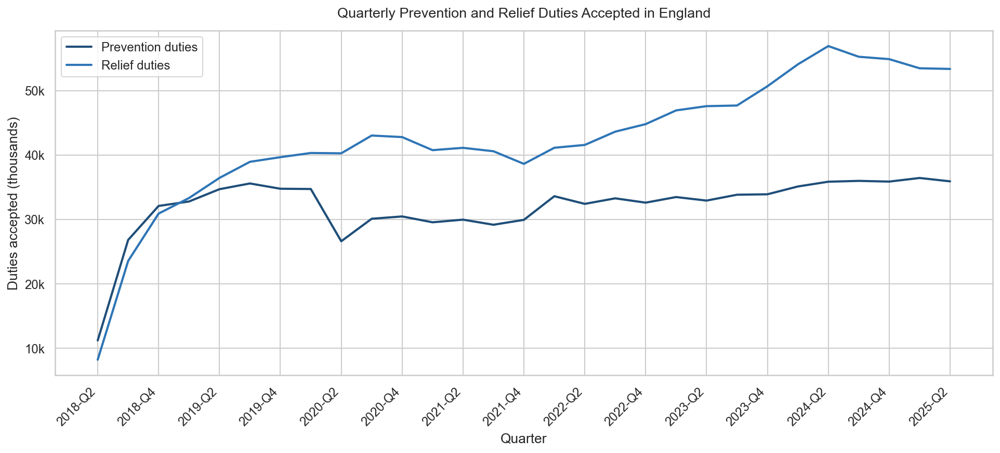
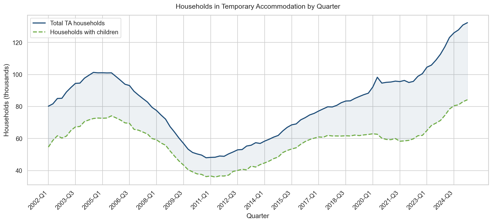
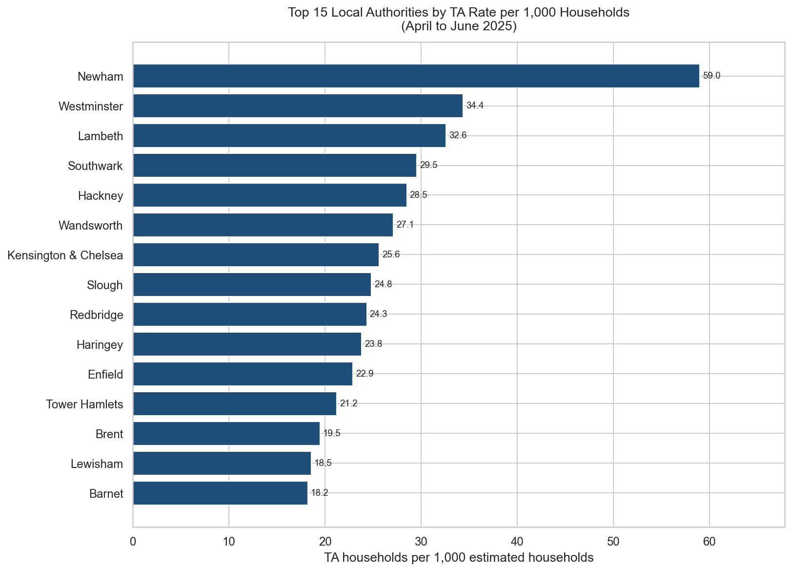
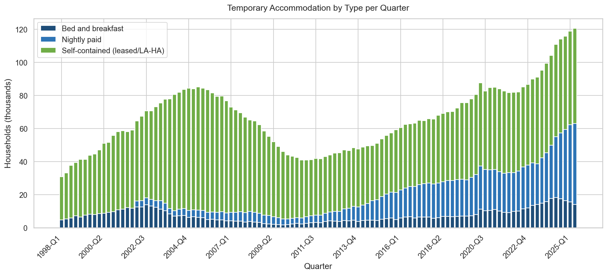
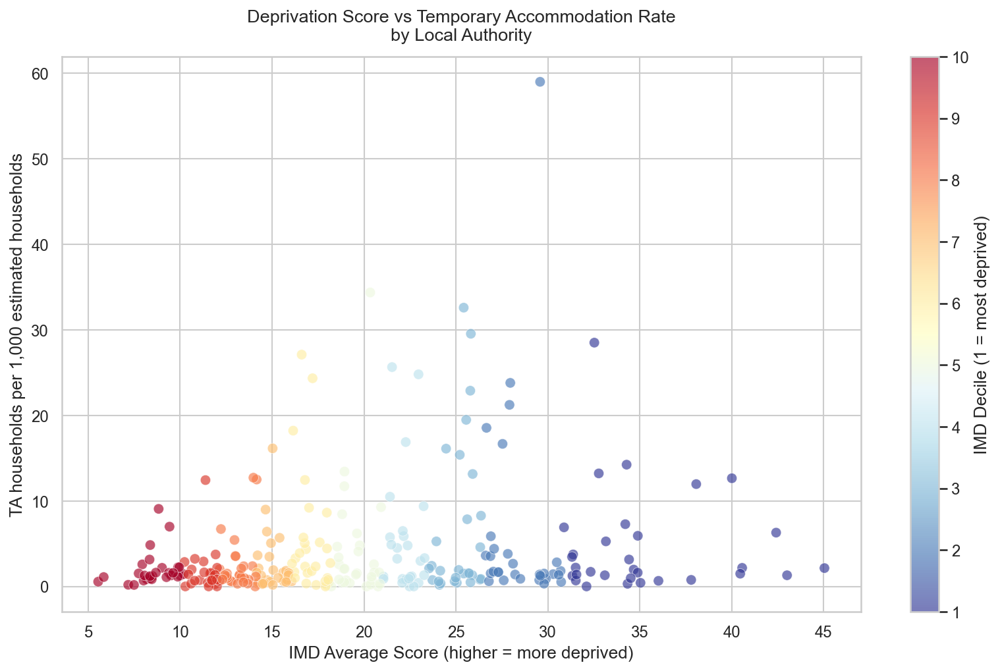

# UK Statutory Homelessness and Temporary Accommodation Analysis

Local councils in England are under legal obligation to assist households threatened with or experiencing homelessness. The scale of this duty has grown substantially since the Homelessness Reduction Act 2017 came into force, and the associated cost of temporary accommodation has become one of the most significant financial pressures facing local government. Understanding the patterns in homelessness data is essential for councils trying to allocate housing resources, anticipate demand, and make the case for funding. This project analyses publicly available statutory homelessness and temporary accommodation statistics for England using SQL Server, Python, and Power BI.

---

## Data Sources

- **MHCLG Statutory Homelessness Statistics** (April to June 2025, revised) - Local authority detailed tables covering TA volumes, duty counts, accommodation type breakdown, and out of area placements. [gov.uk/government/collections/homelessness-statistics](https://www.gov.uk/government/collections/homelessness-statistics)
- **MHCLG England-level Time Series** - Quarterly England totals from 1998 onwards for TA households and from 2018 for prevention and relief duties. Same source as above.
- **ONS Mid-2024 Population Estimates** - Local authority population estimates for England. [ons.gov.uk/peoplepopulationandcommunity/populationandmigration/populationestimates](https://www.ons.gov.uk/peoplepopulationandcommunity/populationandmigration/populationestimates)
- **English Indices of Multiple Deprivation 2019** - LA district summary scores, ranks, and deciles. [gov.uk/government/statistics/english-indices-of-deprivation-2019](https://www.gov.uk/government/statistics/english-indices-of-deprivation-2019)

---

## Key Findings

- **132,340 households** were in temporary accommodation in England in Q2 2025, a rise of 9,310 (+7.6%) on the same quarter in 2024. Of these, 84,220 (64%) had dependent children.

- **Nightly paid accommodation** accounted for 37% of all TA in Q2 2025, up from a much smaller share in 2018. This shift toward the most costly per-night arrangement is a significant driver of financial pressure on councils.

- **B&B accommodation** fell to 10.8% of total TA, though absolute numbers remain high. At Q2 2025, 14,240 households were in B&B, including many with children, despite legal limits on B&B stays for families.

- **42,060 households** (32% of all TA) were placed outside their home council area in Q2 2025, reflecting the shortage of suitable local TA stock, particularly in London.

- **Prevention and relief duties** have grown substantially since the Homelessness Reduction Act 2017. Prevention duties increased by 220% between Q2 2018 and Q2 2025, reaching 35,920 in the most recent quarter.

- **Newham** had the highest TA rate among all local authorities at 59.0 households per 1,000 estimated households, followed by Westminster (34.4) and Lambeth (32.6), reflecting the intensity of homelessness pressure in inner London.

- **Deprivation correlates modestly with TA rates** (Pearson r = 0.19 across all LAs). The relationship is stronger in inner London where both high deprivation and extreme housing cost pressures co-exist, but several low-deprivation coastal areas also show elevated TA rates due to limited housing supply.

---

## Tools Used

SQL Server, Python (pandas, matplotlib, seaborn, openpyxl), Excel, Power BI

---

## Screenshots

### Power BI Dashboard

#### Page 1: Duty Overview

#### Page 2: Temporary Accommodation

#### Page 3: Local Authority Benchmarking

### Python Charts

| Chart | Preview |
|-------|---------|
| Quarterly prevention and relief duties accepted in England since 2018 |  |
| Total households in temporary accommodation per quarter, with children shown as a separate series |  |
| Top 15 local authorities by TA rate per 1,000 estimated households (Q2 2025) |  |
| Temporary accommodation broken down by type (B&B, nightly paid, self-contained) per quarter |  |
| IMD deprivation score vs TA rate per 1,000 households, one dot per local authority |  |
